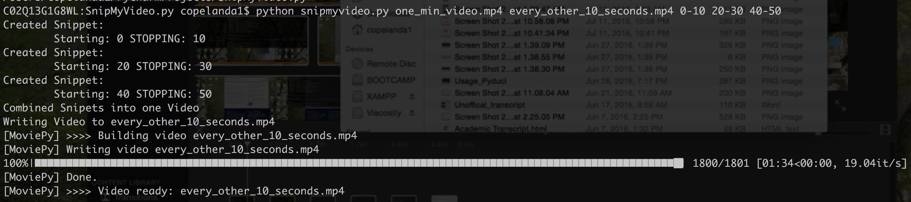

SnipMyVideo
===========

Command Line Video Snipping Tool in Python 2

Ever had a video that was very long and all you wanted to do was really
shorten it. Now you can without any video editing software with
SnipMyVideo.

How does snipmyvideo.py work?

::

        usage: snipmyvideo.py video.mp4 output.mp4 30-1:0 1:30-2:0

    E.g: This command would create two snipets (unlimited snipets can be created),

        the first snipet resembles the time 30seconds to 60 seconds from video.mp4

        These snipets are then concatenated and written to output.mp4

Required Module(s)
==================

-  moviepy

Using SnipMyVideo
=================

   Alt text
